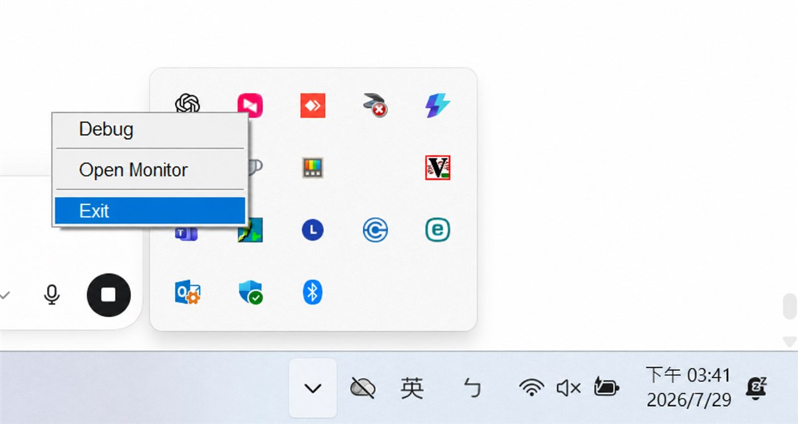
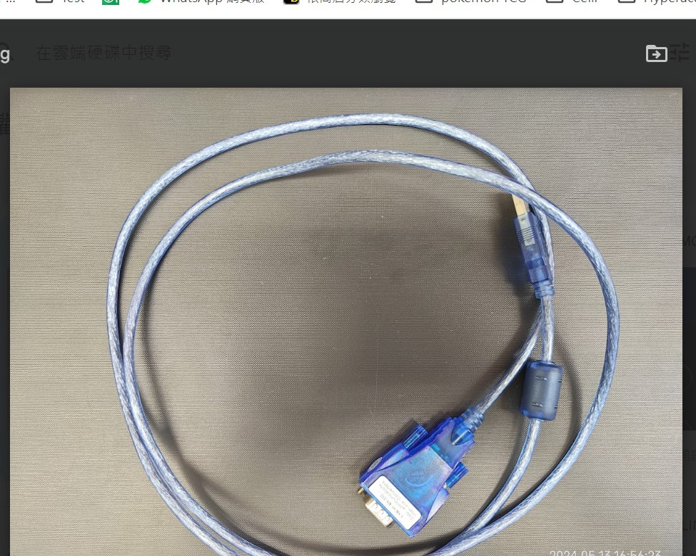
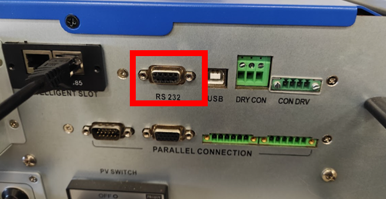
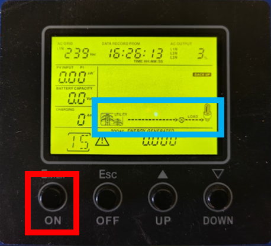
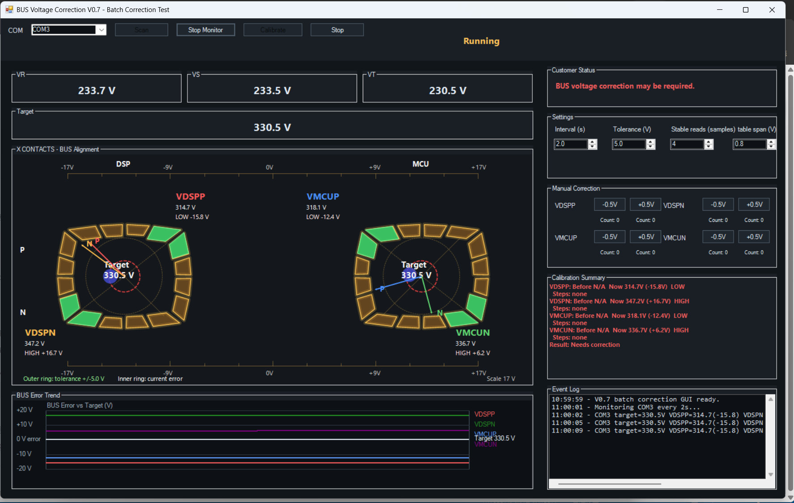
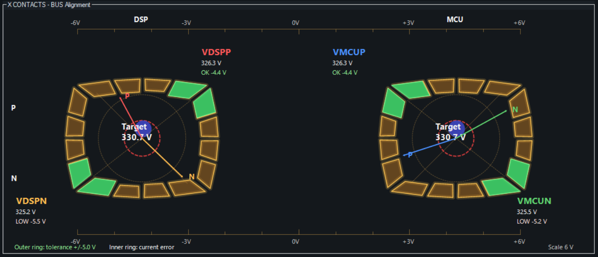
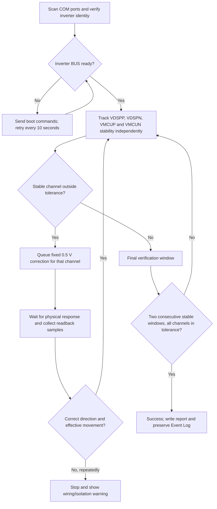

# BUS Voltage Correction

**English (default)** · [繁體中文](README.zh-TW.md)

Windows desktop utility for monitoring and calibrating the DC BUS voltage
measurement channels of FSP PowerManager Hybrid 10 kW and 15 kW inverters.
It locates the inverter COM port, starts the inverter when required, waits for
each channel to stabilize and corrects `VDSPP`, `VDSPN`, `VMCUP` and `VMCUN`
against the calculated BUS target.

> **Service scope:** this utility writes inverter calibration parameters. It is
> intended for trained service personnel. Follow the isolation procedure below
> and the applicable FSP service instructions.

[Download the latest release](https://github.com/tatsuo25103/BUS-Voltage-Correction/releases/latest)
· [V0.7.1 release notes](docs/RELEASE_NOTES_V0.7.1.md)
· [Traditional Chinese instructions](README.zh-TW.md)

## 1. Installation

### 1.1 Verified compatible equipment

- FSP PowerManager Hybrid 10 kW
- FSP PowerManager Hybrid 15 kW
- Windows 10 or Windows 11
- USB-to-RS232 adapter with the appropriate Windows driver

Communication is `2400 baud`, `8 data bits`, no parity and `1 stop bit`
(`8-N-1`).

### 1.2 Install the application

1. Download `BUS_Voltage_Correction_Setup_V0.7.1.exe` from
   [GitHub Releases](https://github.com/tatsuo25103/BUS-Voltage-Correction/releases/latest).
2. Run the installer. It installs for the current Windows user and creates
   Desktop and Start Menu shortcuts.
3. Start **BUS Voltage Correction**.

Python and `pyserial` are not required. The installer does not install the
hardware-specific USB-to-RS232 driver. Windows may show a SmartScreen warning
because the current installer is not code-signed.

## 2. Prepare the inverter

### 2.1 Required isolation

Before automatic calibration:

1. Disconnect **AC Output**.
2. Disconnect **PV**.
3. Disconnect **BAT**.
4. Disconnect the **parallel signal cable**.
5. Leave **AC Grid only** connected.

Calibration stops if the inverter repeatedly does not follow the requested
direction. Recheck this isolation before continuing.

### 2.2 Close other serial applications

Exit SolarPower and any terminal, monitor or service program that may have the
same COM port open. `Access to the port is denied` normally means another
process owns the port.



### 2.3 Connect the service cable

Use a USB-to-RS232 service cable and connect it to the inverter **RS232** port.





Connect AC Grid and switch the inverter on. The application retries the boot
command every 10 seconds until BUS voltage rises and becomes ready.



## 3. Quick start

1. Start **BUS Voltage Correction**.
2. Click **Scan**. Available COM ports are probed and only the expected inverter
   identity response is accepted.
3. Optionally click **Monitor**. Monitoring can remain enabled when calibration
   starts; both operations use one coordinated serial session.
4. Keep advanced stability settings at their defaults. Change only
   **Tolerance** when the service requirement calls for it. Normal is `5.0 V`;
   the selectable range is `1.0-5.0 V`.
5. Click **Calibrate**, review the safety confirmation and continue.
6. Follow **Customer Status**. Do not disconnect AC Grid or communication while
   calibration is running.
7. Wait for **Calibration success**. Click **Open Logs** for the report and
   session log.



## 4. Display and controls

### 4.1 Main controls

| Control | Function |
|---|---|
| **Scan** | Finds the COM port connected to the supported inverter. |
| **Monitor / Stop Monitor** | Starts or stops periodic readback without closing the shared serial session. |
| **Calibrate** | Starts automatic four-channel calibration after safety confirmation. |
| **Stop** | Requests an orderly stop after the current serial operation finishes safely. |
| **Open Logs** | Opens the current user's report and session-log folder. |
| **Tolerance** | Maximum accepted absolute error per channel. Normal: `5.0 V`. |

`Interval`, `Stable reads` and `Stable span` are advanced diagnostic settings.
Leave them at their installed defaults unless an approved service procedure
requires a change.

### 4.2 X CONTACTS alignment

The left display represents DSP and the right display represents MCU. The upper
pointer is positive BUS (`P`); the lower pointer is negative BUS (`N`).

- Green contact segments show tolerance around each target.
- Each pointer shows signed error from the BUS target.
- The center bubble combines P and N error. Perfect alignment is centered; the
  complete bubble must remain inside the dashed tolerance circle.
- **BUS Error Trend** excludes low residual BUS voltage before startup so useful
  calibration movement remains clear.



### 4.3 Manual Correction

Each `-0.5 V` or `+0.5 V` click queues one correction for that channel. The
counter is limited to 20. The opposite direction first cancels queued commands.
A successful command reduces the count by one. Monitoring continues through the
same coordinated COM session. Use this only for service verification;
automatic calibration is the normal workflow.

## 5. Automatic calibration logic



The four channels are evaluated independently. A stable channel can receive its
next correction without waiting for unrelated channels. Multiple eligible
channels are corrected in the same batch round.

Protection rules include:

- fixed `0.5 V` automatic corrections;
- repeated opposite-direction or worsening movement stops calibration;
- six same-direction commands (3.0 V requested) with less than 0.5 V net
  movement stop calibration and request an AC Output/PV/BAT/parallel-cable check;
- final success requires two consecutive complete stable windows with all four
  errors inside tolerance;
- communication interruptions are retried and recorded without freezing the UI.

## 6. Results and logs

**Calibration Summary** shows each channel's stable pre-correction voltage,
current/final voltage and signed error, every correction step such as
`+0.5, +0.5, -0.5 V`, and `OK`, `HIGH`, `LOW` or failure status.

Completion and failure reports contain the summary, detailed correction steps
and Event Log. Files are stored per Windows user in:

```text
%LOCALAPPDATA%\BUS Voltage Correction\logs
```

## 7. Troubleshooting

| Symptom | Action |
|---|---|
| No COM port found | Check adapter, Windows driver and RS232 connection; reconnect and scan again. |
| `Access to the port is denied` | Exit SolarPower and other serial tools, then reopen the application. |
| Inverter does not start | Confirm AC Grid. Boot commands retry every 10 seconds for up to four minutes. |
| Communication is interrupted | Keep the cable connected. Monitor retries automatically; inspect cable quality if failures continue. |
| Channel does not move after six corrections | Stop and confirm AC Output, PV, BAT and parallel cable are disconnected. |
| Channel moves opposite or becomes worse | Stop and inspect inverter state, wiring and command compatibility. |
| Calibration is stopped manually | The current readback may finish first; a partial report is still generated. |
| Trend is empty at startup | Expected until BUS voltage reaches the calibration-ready region. |

## 8. Updates

At startup the application checks GitHub Releases in the background. A prompt
appears only when calibration, manual correction and other dialogs are idle.
Offline or failed checks do not interrupt operation.

V0.7.1 adds the background update check, MES branding, improved failure reports
and stable pre-correction voltage capture. See the
[V0.7.1 release notes](docs/RELEASE_NOTES_V0.7.1.md). Previous packages remain
on the [Releases page](https://github.com/tatsuo25103/BUS-Voltage-Correction/releases).
