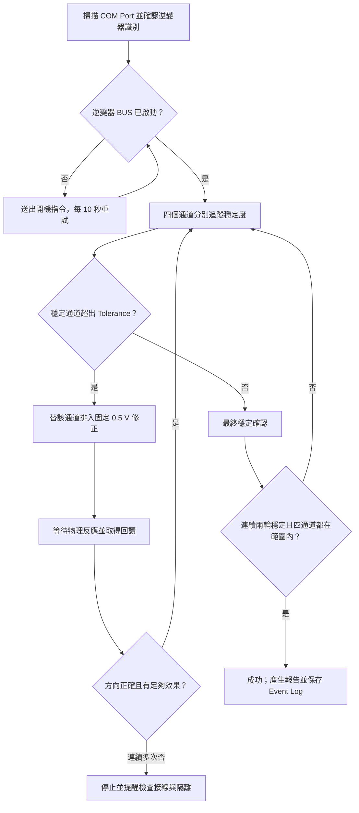

# BUS Voltage Correction

[English（預設）](README.md) · **繁體中文**

這是用於 FSP PowerManager Hybrid 10 kW／15 kW 逆變器的 Windows 桌面工具，
可監看並校正 DC BUS 電壓量測通道 `VDSPP`、`VDSPN`、`VMCUP`、`VMCUN`。
程式會尋找逆變器所在的 COM Port，必要時嘗試啟動逆變器，分別等待每個通道
穩定，再依 BUS Target 進行校正。

> **使用範圍：**本程式會寫入逆變器校正參數，只適合受過訓練的維修人員。
> 必須依照下列隔離程序與 FSP 維修規範操作。

[下載最新版本](https://github.com/tatsuo25103/BUS-Voltage-Correction/releases/latest)
· [V0.7.1 更新資訊](docs/RELEASE_NOTES_V0.7.1.zh-TW.md)
· [英文使用說明](README.md)

## 1. 安裝

### 1.1 已驗證相容設備

- FSP PowerManager Hybrid 10 kW
- FSP PowerManager Hybrid 15 kW
- Windows 10 或 Windows 11
- 已安裝正確 Windows 驅動的 USB 轉 RS232 線

通訊設定為 `2400 baud`、`8 data bits`、無同位元、`1 stop bit`（`8-N-1`）。

### 1.2 安裝程式

1. 從 [GitHub Releases](https://github.com/tatsuo25103/BUS-Voltage-Correction/releases/latest)
   下載 `BUS_Voltage_Correction_Setup_V0.7.1.exe`。
2. 執行安裝程式。它會安裝在目前 Windows 使用者帳號，並建立桌面與開始
   功能表捷徑。
3. 啟動 **BUS Voltage Correction**。

安裝後不需要 Python 或 `pyserial`。安裝程式不包含 USB 轉 RS232 晶片的
驅動；若 Windows 沒有建立 COM Port，請先安裝轉接線驅動。目前安裝檔沒有
程式碼簽章，因此 Windows 可能顯示 SmartScreen 提醒。

## 2. 準備逆變器

### 2.1 必要隔離

執行自動校正前：

1. 斷開 **AC Output**。
2. 斷開 **PV**。
3. 斷開 **BAT**。
4. 拔除**並聯訊號線**。
5. 只保留 **AC Grid**。

若逆變器連續多次沒有依指令方向改變，程式會停止。再次執行前必須重新確認
上述隔離條件。

### 2.2 關閉其他通訊程式

完全退出 SolarPower，以及任何可能開啟同一個 COM Port 的終端機或維修
程式。顯示 `Access to the port is denied` 通常代表 Port 被其他程式占用。


### 2.3 連接維修線

使用 USB 轉 RS232 維修線，接到逆變器的 **RS232** Port。


接上 AC Grid 並開啟逆變器。BUS 尚未升壓時，程式會每 10 秒重送開機指令，
直到電壓進入可校正狀態。


## 3. 快速操作

1. 啟動 **BUS Voltage Correction**。
2. 按 **Scan**。程式會探測 COM Port，只接受正確的逆變器識別回覆。
3. 可先按 **Monitor**。開始校正時不必關閉 Monitor；兩者共用同一個受控
   Serial Session，不會搶占 COM Port。
4. 進階穩定條件請保留預設值。一般只需依維修要求調整 **Tolerance**；正常
   為 `5.0 V`，可選範圍 `1.0-5.0 V`。
5. 按 **Calibrate**，確認安全提醒後開始。
6. 依 **Customer Status** 等待，校正中不可拔除 AC Grid 或通訊線。
7. 等待 **Calibration success**。按 **Open Logs** 開啟報告與 Session Log。


## 4. 畫面與控制

### 4.1 主要控制

| 按鈕／欄位 | 功能 |
|---|---|
| **Scan** | 尋找支援逆變器所在的 COM Port。 |
| **Monitor / Stop Monitor** | 開始／停止讀值，不關閉共用 Serial Session。 |
| **Calibrate** | 安全確認後啟動四通道自動校正。 |
| **Stop** | 等目前通訊動作安全完成後停止。 |
| **Open Logs** | 開啟目前使用者的報告與 Log 資料夾。 |
| **Tolerance** | 每個通道可接受的最大絕對誤差；正常為 `5.0 V`。 |

`Interval`、`Stable reads`、`Stable span` 是進階診斷設定。除非有核准維修
程序要求，否則請保留安裝後預設值。

### 4.2 X CONTACTS 校正圖

左側是 DSP，右側是 MCU；上方指針為正 BUS（`P`），下方為負 BUS（`N`）。

- 綠色區段代表各 Target 正負方向的 Tolerance。
- 指針顯示目前通道相對 Target 的正負誤差。
- 中央氣泡結合 P、N 誤差；完美時位於中心，完成時整個氣泡必須在虛線圓內。
- **BUS Error Trend** 排除開機前 DC BUS 電容殘壓，避免真正波動看不清楚。


### 4.3 Manual Correction

每按一次 `-0.5 V`／`+0.5 V` 會排入一筆修正，每個通道最多 20 次。先按
相反方向會抵銷尚未執行的 Count；成功後 Count 減一。Monitor 透過同一個
受控 COM Session 繼續工作。此功能只建議用於維修驗證。

## 5. 自動校正邏輯



四個通道分別判斷穩定度。某通道穩定後，不必等待其他通道即可進行下一步；
同一輪有多個通道需要修正時，會在同一批次依序送出。

保護邏輯包括：

- 自動校正固定使用 `0.5 V` 指令；
- 連續反方向或誤差惡化時停止；
- 同方向連續六次（累積要求 3.0 V），實際淨變化仍小於 0.5 V 時停止，並
  提醒檢查 AC Output、PV、BAT、並聯訊號線；
- 最後必須連續兩個穩定視窗，四個誤差都在 Tolerance 內才成功；
- 通訊中斷會重試並記錄，不會讓 GUI 永久無回應。

## 6. 結果與紀錄

**Calibration Summary** 顯示每個通道第一次修正前的穩定電壓、目前／最終
電壓與正負誤差、每一步修正（例如 `+0.5, +0.5, -0.5 V`），以及 `OK`、
`HIGH`、`LOW` 或失敗原因。

成功或失敗都會嘗試產生包含 Summary、修正步驟與 Event Log 的報告：

```text
%LOCALAPPDATA%\BUS Voltage Correction\logs
```

## 7. 常見問題

| 狀況 | 處理方式 |
|---|---|
| 找不到 COM Port | 檢查轉接線、Windows 驅動與 RS232 接頭，重新插拔後再 Scan。 |
| `Access to the port is denied` | 完全退出 SolarPower 與其他 Serial 工具後重開程式。 |
| 逆變器沒有啟動 | 確認 AC Grid；程式每 10 秒重送開機指令，最多等待四分鐘。 |
| 通訊偶爾中斷 | 保持線材連接；Monitor 自動重試，持續失敗時檢查線材品質。 |
| 六次修正後幾乎不動 | 停止並確認 AC Output、PV、BAT、並聯訊號線都已斷開。 |
| 朝相反方向或誤差惡化 | 停止並檢查逆變器狀態、接線與指令相容性。 |
| 使用者手動停止 | 目前回讀可能先完成；程式仍會產生部分報告。 |
| 開機時 Trend 沒有曲線 | 正常；BUS 電壓進入可校正區間後才開始記錄。 |

## 8. 更新

程式啟動時會在背景檢查 GitHub Releases。只有目前沒有校正、Manual
Correction 或其他對話框時才顯示新版提示；離線或檢查失敗不會中斷操作。

V0.7.1 新增背景更新檢查、MES Logo、失敗報告保護與校正前穩定電壓紀錄。
詳見 [V0.7.1 更新資訊](docs/RELEASE_NOTES_V0.7.1.zh-TW.md)。舊版保留在
[Releases](https://github.com/tatsuo25103/BUS-Voltage-Correction/releases)。
